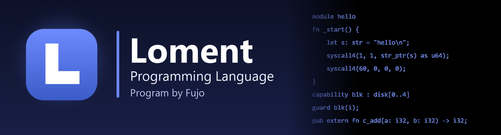
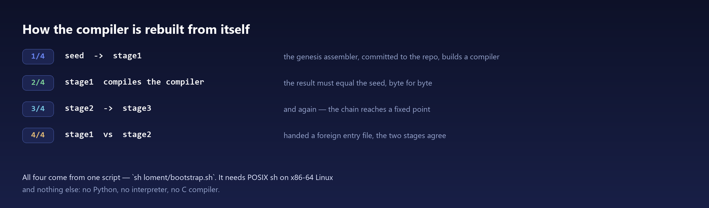
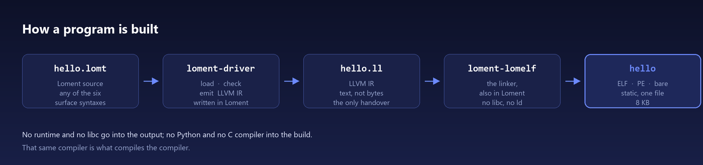
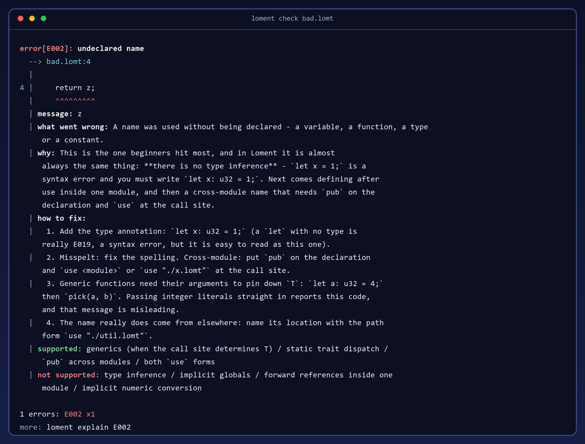

# Loment

Loment is a **systems programming language**. It compiles to native x86-64 executables —
Linux ELF, Windows PE, or a freestanding object for bare metal — with no runtime and no
libc. The toolchain is itself written in Loment and needs no Python to run. Its own syntax
is Rust-flavored, and the same program can be written in six more: C, C++, Java, C#, Go or
Python.

**[Quick start](QUICKSTART.md)** ·
[Project site](https://fujojtop.github.io/FujoOSwebsite/loment/) ·
[Manual](docs/manual/index.md) ·
[Language guide](.claude/skills/loment/SKILL.md) ·
[Examples](loment/examples/) ·
[Contributing](CONTRIBUTING.md) ·
[Issues](https://github.com/FujoJTOP/loment/issues)

## Status

`0.1.4`. Nothing is published as a package yet — you build the toolchain from a checkout
([QUICKSTART.md](QUICKSTART.md)).

The toolchain is **self-hosted at run time**: it compiles and runs with no Python and no
libc. The **development side is not**, and closing that gap is what 0.1.4 is for
([docs/189](docs/189-full-selfhosting.md)): `tools/` still holds the reference
implementation (`tools/lomentc.py` and friends) and the Python test suites. The work is done
one criterion at a time — each Python criterion gains a Loment twin, and the two must agree
byte for byte before the Python side can be retired. Until that finishes, both copies are in
the repository on purpose, and "the repository contains only Loment" is not yet true.

The language surface is frozen — [docs/158](docs/158-loment-freeze.md) says what changing it
costs — and the implementation is not.



## A first program

```rust
module hello

fn _start() {
    let s: str = "hello from Loment\n";
    syscall4(1, 1, str_ptr(s) as u64, str_len(s) as u64);
    syscall4(60, 0, 0, 0);
}
```

```
$ loment run hello.lomt
hello from Loment
```

`_start` is the entry point, because there is no runtime to call one for you, and output goes
through the `write` system call, because there is no `printf`. [QUICKSTART.md](QUICKSTART.md)
takes it from here — sources, toolchain, and the first four rows below.



## What it is for

Most languages answer "what can this program do?". Loment is arranged around a narrower
question — **who can run what, in what scope, and can that be settled without reading the
source?** Three things carry it:

| | |
|---|---|
| **Capability domains** | `capability blk : disk[0..4]` declares the range a unit may reach and `guard blk(i);` checks the index against it — at compile time when the index is a literal, otherwise at run time, where an out-of-range index traps. [docs/146](docs/146-loment-capability-semantics.md) states the boundary rather than glossing it: a guard bounds the *index*, not the *subject*. |
| **Potato form objects** | Every unit exports a declared, machine-readable summary of what it contains and what it reaches, judged by two independent validators — so "what can this touch" is answerable without reading the source. [docs/147](docs/147-potato-v1-spec.md) |
| **A compat layer** | Ten languages' libraries, callable end to end: C, C++, Rust and Zig behind the C ABI by static linking, then Go, Python, Java, JavaScript, Perl and Lua over a process bridge. [docs/173](docs/173-loment-ffi.md) is the honest ledger — dynamic libraries and embedding a runtime are not started. |

The rest of the language exists to keep that question answerable. The core stays small; what
grows is the layer around it ([docs/175](docs/175-loment-014-direction.md)).

## What else is different

| | |
|---|---|
| **A standard library, imported one module at a time** | `lompi/store/` ships with the toolchain: `std` (127 modules — vectors, maps, text, big integers, floats, hashing, compression) and `host` (files, argv, directories). `use vec`, `use map`, `use fs`. The package facade `use std` also works, but pulls all 127 modules into one unit — emitted symbols are flat, so that is slow and collision-prone. Prefer per-module. |
| **Can be written in six other syntaxes** | C, C++, Java, C#, Go, Python. Only the spelling changes; the meaning is always Loment's — it is a syntax, not a semantics, and each front end says so on its first line. Declaring it in the file (`choose write grammar`) is not wired into the compiler yet; the translators are. [docs/188](docs/188-grammar-declaration.md) · [docs/179](docs/179-multisyntax-frontends.md) |
| **A project mode, not a crate attribute** | `choose std` or `choose no_std`, at most once, in the root unit. "Hosted or freestanding" becomes a property of the whole program — the compiler can refuse a half-hosted one, and a form object can carry the setting. [docs/180](docs/180-std-core.md) |
| **Reports errors from a separate program** | The compiler emits structured diagnostics; `lomenterr` adds the title, the location and how to fix it, so the compiler carries no message table of its own. [docs/182](docs/182-lomenterr-and-choose-switches.md) |
| **Everything is customizable** | The source suffix, the command surface (`loment-<name>` on `PATH`; official commands always win), the libraries (a directory whose identity is a content hash), and the toolchain itself. No registry — the extension points are files on disk. |

That last row, in full — the report you actually read when a line does not compile. The
compiler emitted a code and a position; everything below `message:` came from `lomenterr`:



## Documentation

| | |
|---|---|
| `.claude/skills/loment/SKILL.md` | The language guide: syntax, built-ins, error codes, and the deviations from Rust. Self-contained, shipped inside the package (`loment skill --print`), and the fastest way in. |
| `loment/examples/tour.lomt` | The whole language in one file, with commentary (`loment example tour`). |
| `docs/manual/` | The generated manual: specifications, plus a page per example. |
| `docs/143-l1-loment-v0.md` · `docs/146` · `docs/158` | The specification, capability semantics, and what is frozen. |
| `docs/173` · `docs/188` · `docs/189` | The three long-running threads: the compat layer, multi-syntax, and full self-hosting. |
| `docs/` | Design and measurement records, numbered by document. Most are written in Chinese. |
| [FujoJTOP/lompi](https://github.com/FujoJTOP/lompi) | The package manager. |

## Repository layout

| | |
|---|---|
| `loment/selfhost/` | The compiler. It is written in Loment. |
| `loment/tools/` | CLI, formatter, documentation generator, language server, linker, error reporter — and the Loment-side criteria that mirror `tools/`. |
| `loment/lib/` | Core library modules: `mem`, `num`, `json`, `sha256`, `proc`; plus `lumtui`, a terminal UI library ([docs/196](docs/196-lumtui.md)). |
| `lompi/store/` | The standard library, shipped with the toolchain: `std` (127 modules) and `host` (syscalls, files, argv, directories). One `use` per module — `use vec`, `use map`, `use fs`. |
| `loment/examples/` | 30 example programs. |
| `lom/` | Interface layer: one declaration source that generates constants and decoders for other languages. |
| `lompi/` | The package manager, written in Loment. |
| `editors/` | Editor support: VS Code and Vim. |
| `tools/` | The reference implementation and the Python test suites. This is what 0.1.4 removes — see Status. |
| `docs/` | Design and measurement records. |

## How this is built

Loment is developed with AI coding agents in the loop, and says so: `CLAUDE.md` and
`AGENTS.md` at the root are the working conventions, and the language guide sits where agents
are configured to look for it — the same file ships in the package as `loment skill --print`.
What that buys is less the tooling than the discipline around it: a change here is checked by
a program rather than by a reviewer's memory. Two implementations of the language surface must
agree byte for byte, every claim in `docs/` is tied to a criterion, and those criteria are
what keep the claims on this page honest.

## Getting help and contributing

Ask in an [issue](https://github.com/FujoJTOP/loment/issues) — questions are as welcome as
bug reports. Loment is developed in this repository; the working conventions, including how a
change is checked before it lands, are in `AGENTS.md`.

## License

MIT. See [LICENSE](LICENSE).
